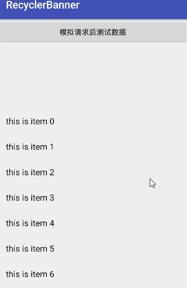
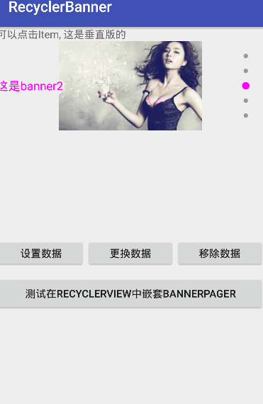

# RecyclerViewBanner
#### RecyclerViewBanner extends ViewGroup, 用RecyclerView 实现Banner无限轮播效果支持Lifecycle自动管理, 效果与ViewPager一样不上传效果图, 没有过度的封装

## 为何要用RecyclerView实现
###### 1: 既然是轮播就是内容模块大致相同,RecyclerView拥有强大的缓存机制可以直接实现相同Item的缓存
###### 2: RecyclerView的Adapter可以针对不同Item的  ViewType来缓存不同的Item
###### 3: ViewPager在生成Item的时候(Object instantiateItem(ViewGroup container, final int position))控件还未添加到ViewPager中,此时生成的Item中的控件的生命周期都没有触发,(比如获取Item控件的大小就无法做到), 而RecyclerView适配器中有onBindViewHolder机制与onViewRecycled, onViewAttachedToWindow,onViewDetachedFromWindow等强大的生命周期机制
###### 4: RecyclerView已经自带的解决了与ViewPager, RecyclerView等滑动控件中的嵌套滑动冲突
###### 5: 当Banner嵌套在RecyclerView或ListView中时, 在Banner滑动动画还结束时,如果列表滑动缓存了banner,此时ViewPager方式的Banner会出现动画停留甚至白屏的效果,而RecyclerView可以完美的解决这问题
###### 6: RecyclerView自带是否预加载(即懒加载)功能,可以垂直方向,水平方向滑动, 及各种很炫的效果
###### 7: 实现无限循环有两种机制, 1: 把itemCount设置成Integer.Max_VALUE, 但是在页面刷新setCurrentItem的时候会出现卡顿ANR  2: 在实际的iteCount前后添加最后一个和第一个item, 但是ViewPager是需要预加载的, 在滑动到最后一项快速滑动的时候,会出现空白, 所以是在前后加上一定数量的项


#### 使用

```
allprojects {
    repositories {
        ...
        maven { url 'https://jitpack.io' }
    }  
}

dependencies {
	implementation 'com.github.youxiaochen:RecyclerViewBanner:1.2.0'
}
```

#### 属性描述
```
<!-- BannerPager -->
<declare-styleable name="BannerPager">

    <!-- 布局方向 -->
    <attr name="bannerOrientation">
        <enum name="vertical" value="1" />
        <enum name="horizontal" value="0" />
    </attr>

    <!-- 自动轮播动画时间, 为0时按原始 -->
    <attr name="bannerDuration" format="integer" />

    <!-- 轮播间隔 -->
    <attr name="bannerInterval" format="integer" />

    <!-- 自动轮播 -->
    <attr name="bannerAuto" format="boolean" />

</declare-styleable>

<!-- IndicatorView 指示器 -->
<declare-styleable name="IndicatorView">

    <!-- 指示器间隙 -->
    <attr name="indicatorMargin" format="dimension" />

    <!-- 指示背景需要配置 state_selected true与false 的属性-->
    <attr name="indicatorDrawable" format="reference" />

    <!-- 布局方向 -->
    <attr name="indicatorOrientation">
        <enum name="vertical" value="1" />
        <enum name="horizontal" value="0" />
    </attr>

</declare-styleable>
```
#### 效果图




#### 示例代码

```
<?xml version="1.0" encoding="utf-8"?>
<FrameLayout xmlns:android="http://schemas.android.com/apk/res/android"
    xmlns:app="http://schemas.android.com/apk/res-auto"
    android:layout_width="match_parent"
    android:layout_height="120dp">

    <chen.you.banner.BannerPager
        android:id="@+id/bp"
        android:layout_width="match_parent"
        android:layout_height="match_parent"
        app:bannerOrientation="horizontal"
        app:bannerDuration="1000"
        app:bannerInterval="3000"
        app:bannerAuto="true"/>

    <chen.you.banner.IndicatorView
        android:id="@+id/iv"
        android:layout_width="wrap_content"
        android:layout_height="wrap_content"
        android:layout_gravity="bottom|center_horizontal"
        android:layout_marginBottom="10dp"
        app:indicatorDrawable="@drawable/bg_banner2"
        app:indicatorOrientation="horizontal"
        app:indicatorMargin="10dp"/>

</FrameLayout>

<?xml version="1.0" encoding="utf-8"?>
<selector xmlns:android="http://schemas.android.com/apk/res/android">
    <item android:state_selected="false" android:drawable="@drawable/banner"/>
    <item android:state_selected="true" android:drawable="@drawable/banner_s"/>
</selector>

```

#### 代码控制
```
BannerPager bp = findViewById(R.id.bp);
IndicatorView iv = findViewById(R.id.iv);
bp.setLifecycleOwner(this);  //设置生命管理
bp.setupWithIndicator(iv1); //绑定指示器
bp.setPageTransformer(new ZoomOutTransformer()); //设置PageTransformer各种特效

bp0.setAdapter(......);
```